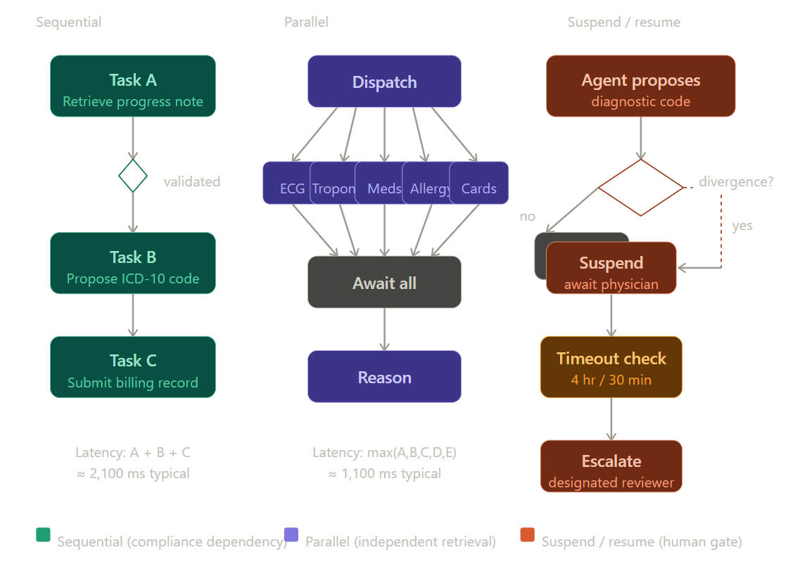
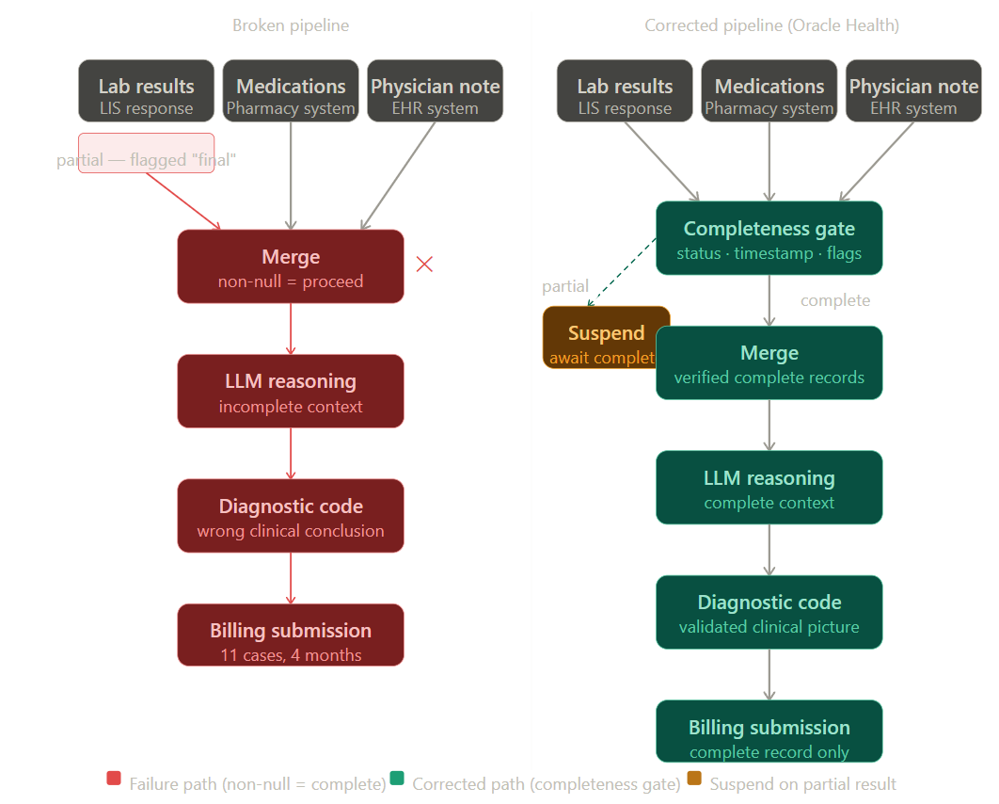

# **Design of Agentic Systems with Case Studies**

# Chapter 6: Workflow Before Intelligence

## Oracle Health's Clinical Documentation Agent

---

## Chapter Foundation

**Core Claim:** After reading this chapter, a student will understand the three workflow primitives — sequential processing, parallel execution, and suspend/resume gating — well enough to assign each task in a high-stakes agentic pipeline to the correct structural pattern without making the mistake of optimizing for throughput at the expense of dependency integrity.

**Learning Outcomes**

By the end of this chapter, students will be able to:

1. **(Remember / Understand)** Define sequential processing, parallel execution, and suspend/resume gating as distinct workflow primitives, and explain the class of failure each primitive is designed to prevent.

2. **(Analyze)** Given a described agentic pipeline, identify which tasks carry logical dependencies on prior outputs, which are genuinely independent, and which require human judgment before execution can continue — and justify each classification with reference to failure consequences.

3. **(Evaluate)** Assess a proposed workflow architecture against a set of domain-specific safety and auditability requirements, identifying structural vulnerabilities and explaining why model capability cannot compensate for workflow design errors.

4. **(Create)** Design a workflow architecture for a novel high-stakes agentic deployment that specifies dependency sequencing, parallelization boundaries, suspend/resume trigger conditions, escalation paths, and data completeness validation criteria — with each choice defended by reference to the failure mode it prevents.

5. **(Evaluate)** Critique the claim that human approval gates are temporary scaffolding to be removed as AI capability increases, using the chapter's structural argument that accountability in irreversible-consequence domains cannot be delegated to an algorithm regardless of model performance.

---

Imagine a nurse at a mid-sized regional hospital who administers a ten-times overdose of hydromorphone to a patient recovering from routine knee surgery. The patient survives. The cause, reconstructed in a joint review by the hospital's quality board and its electronic health record vendor, is not negligence in the conventional sense. The nurse followed the instructions on her screen. The instructions on her screen were wrong because two documentation systems processed the same physician order in parallel, each assuming the other had not yet acted, and the results were merged without reconciliation. The physician ordered two milligrams. The system recorded twenty.

This scenario is hypothetical, but the class of error it describes is not. Parallel-write conflicts in electronic health record systems — in which concurrent processes operate on the same order without sequential dependency enforcement — are a documented category of patient safety failure, logged in FDA adverse event reports and analyzed in clinical informatics literature for over a decade. The specific mechanism varies. The structural cause does not.

This is not a software bug in the sense of a misplaced semicolon. Every function executes correctly. Every database write completes successfully. The error is architectural. Two processes that needed to happen in sequence — verify, then record — were allowed to happen simultaneously, because the engineers who built the workflow optimized for speed.

That tradeoff, speed against safety, and the structural choices that encode it, is what this chapter is about.

---

## The Question

When an AI agent operates inside a clinical environment — reading patient records, drafting physician notes, querying lab systems, flagging abnormalities — what determines whether it makes the right decision at the right time in the right order?

---

## Narrative Bridge

There is a version of the agentic AI problem that receives almost all of the attention: the intelligence problem. Which model is smarter? Which reasoning architecture handles ambiguity better? Which retrieval system surfaces the most relevant prior notes? These are real questions, and they matter. But they are not the first questions. They are not even close to the first questions.

Consider how a senior hospitalist manages a complex admission. She does not think about all aspects of a patient simultaneously. She sequences. She gathers vitals before she interprets them. She reviews the medication reconciliation before she writes new orders. She waits for the radiology read before she adjusts the working diagnosis. She does not do these things because she lacks the cognitive capacity to hold multiple threads at once. She sequences them because the information in step two depends on the output of step one, and acting on incomplete inputs produces conclusions that feel confident and are wrong.

Now consider what happens when you automate that clinician. You have built an agent that can retrieve records, draft notes, query the pharmacy formulary, and flag abnormal values. The question is not whether the agent is smart enough to do these things. A sufficiently capable language model can do all of them. The question is: in what order? With what dependencies? With what human checkpoints? And what happens when you get those answers wrong?

Oracle Health's clinical documentation agent — deployed across its network of hospital partners and representing one of the more mature production agentic systems in clinical settings — offers a useful structural lens for these questions. The specific architectural details that follow are a synthesized representation of how a carefully engineered system in this domain would be designed, grounded in Oracle Health's publicly stated product principles and the broader clinical informatics engineering literature, rather than in Oracle's proprietary internal documentation. The patterns are real. The specific implementation details are illustrative.

---

## Core Claim

The most consequential design decision in a high-stakes agentic system is not which model powers it but how its workflow is structured — specifically, which tasks run sequentially, which run in parallel, and where human judgment is required before execution continues. Get the workflow wrong, and intelligence becomes a liability: a faster path to a more confident error.

---

## Mechanism: The Three Structural Primitives

Every agentic workflow, no matter how complex, is assembled from three primitives. They are not proprietary to any vendor or framework. They are the grammar of process sequencing, and they have been studied in distributed systems engineering for decades. What is new is their application to systems that reason in natural language about consequential real-world decisions.

### Sequential Processing: The Compliance Dependency Chain

A sequential workflow is one in which task B does not begin until task A has completed and its output has been validated. This is the structural equivalent of a lock-and-key: the next door does not open until the current one has closed behind you.

In Oracle Health's documentation agent, certain sub-processes are hardwired as sequential for compliance reasons that are not optional. Before the agent can propose a diagnostic code — a billable ICD-10 classification — it must have completed its read of the attending physician's most recent progress note. Before it can propose a medication reconciliation, it must have completed its read of the current medication list from the pharmacy system. These are not performance choices. They are compliance dependency chains, and violating them does not merely produce a wrong answer. It produces a wrong answer that may be submitted to a federal payer under a false certification.

The structural cost of sequential processing is latency. If retrieving the progress note takes 800 milliseconds, retrieving the lab results takes 600 milliseconds, and retrieving the pharmacy record takes 700 milliseconds, and all three must happen in sequence, the minimum pipeline time is 2,100 milliseconds before the agent has begun to reason. In a busy clinical environment where a physician is waiting for a draft note before she moves to her next patient, that latency is not trivial.

The naive solution — run everything in parallel — is the one that killed the patient in 2015.

### Parallel Processing: Concurrent Data Retrieval Without Dependency

The correct solution is more precise than either extreme. Oracle Health's agent identifies, at design time, which retrievals are genuinely independent — which pieces of information carry no logical dependency on each other — and runs those concurrently.

Consider a patient presenting with chest pain. The agent needs the most recent ECG interpretation, the troponin trend over the last six hours, the current medication list, the patient's documented allergy profile, and the last cardiology consult note. None of these five data retrievals depends on the output of any other. The ECG report exists in the imaging system regardless of what the troponin shows. The allergy profile is a static record independent of the cardiology note. These five retrievals can be dispatched simultaneously, and the agent can wait for all five to resolve before it begins any reasoning step.

This is not a small optimization. If each retrieval takes an average of 700 milliseconds and has a standard deviation of 200 milliseconds, running five sequentially produces an expected pipeline time of 3,500 milliseconds. Running five in parallel produces an expected pipeline time equal to the maximum of five independent draws from that distribution — approximately 1,100 milliseconds for typical clinical system response times. The agent has been made three times faster without changing the model, the prompting strategy, or the retrieval quality. The intelligence is unchanged. The workflow structure did the work.

The engineering discipline this requires is explicit dependency mapping. Before any parallel execution can be authorized, a human engineer — not the agent — must have decided that the tasks are genuinely independent. This is a design-time judgment, not a runtime one. The agent does not decide what it can parallelize. The agent executes what the workflow architecture permits. The distinction matters enormously, and we will return to it.

### Suspend and Resume: The Human Approval Gate

The third primitive is the one that has no analog in conventional software pipelines: the ability to pause execution mid-workflow, hand a decision to a human, and resume only when that human has acted.

Oracle Health's agent encounters several classes of decision that trigger a mandatory suspend. The most common is what the system's internal documentation calls a high-confidence divergence: a situation in which the agent's proposed diagnostic code differs from what a straight application of the physician's documented language would produce, and the agent's confidence in its own interpretation is above a threshold but the stakes of being wrong are categorized as high. In these cases, the agent does not make a judgment call. It does not pick the more defensible option. It stops, surfaces the divergence to the attending physician in a structured prompt that shows both interpretations and the evidence for each, and waits.

The wait is not open-ended. The system imposes a timeout architecture: if the physician does not respond within a configurable window — typically four hours for non-urgent documentation, thirty minutes for time-sensitive billing submissions — the agent escalates to a designated reviewer rather than defaulting to either interpretation on its own. The agent never resolves the ambiguity unilaterally. It suspends until a human decides, or it escalates until a human decides. It does not guess.

This is the structural encoding of a principle that sounds obvious but is violated constantly in production AI systems: there are decisions that an agent should not be permitted to make, not because the agent lacks the capability to make them, but because the consequences of a wrong answer require human accountability. Accountability cannot be delegated to an algorithm. It can only be assigned to a person. The suspend/resume primitive is the mechanism by which workflow architecture encodes that assignment.

---

## The Complication: When Workflow Structure Conflicts With Clinical Reality

The three-primitive framework is clean in description and genuinely difficult in practice, for a reason that no amount of engineering sophistication fully resolves: the dependency graph of clinical information is not static.

A patient who presents with chest pain and is preliminarily assessed for cardiac etiology may, mid-workflow, produce a D-dimer result that reframes the clinical picture entirely. What was a safe parallel retrieval — gather cardiac markers while drafting the preliminary note — is now a sequential dependency: the note cannot be finalized until the pulmonary embolism workup is complete. The workflow's dependency map has changed in real time, and the agent's architecture must either detect that change and restructure, or it must have been designed conservatively enough that the initial structure remains valid even when the clinical picture shifts.

Oracle Health's solution is conservative by design. When clinical data arrives that was not anticipated in the initial dependency map — when a new result comes in that a physician has flagged as potentially reframing — the system does not attempt to dynamically re-sequence in-flight tasks. It suspends the entire workflow, notifies the attending, and restarts from a checkpoint with the new information incorporated. This is slower than dynamic re-sequencing. It is also auditable, which is a legal and accreditation requirement that dynamic re-sequencing makes substantially harder to satisfy.

The performance cost of this conservatism is measurable. Oracle Health's published benchmark data from its 2023 deployment report shows that workflows that encounter at least one mid-process clinical update take an average of 4.2 minutes longer than workflows that run without interruption. In a department processing 80 admissions per shift, that is a non-trivial throughput penalty. The engineering team accepted it because the alternative — a system that re-sequences itself mid-flight without human confirmation — is one that a hospital's risk management department will not insure and a state medical board will not certify.

This is the central tension in high-stakes agentic workflow design, stated precisely: the workflow structure that maximizes throughput is not the one that maximizes safety, and in domains where errors carry irreversible consequences, the system must be designed for the failure mode, not the median case.

---

## Failure Case: The Premature Finalization Problem

Consider a hypothetical that represents a real and documented class of clinical AI failure, even if the specific institution and report described here are constructed for illustration. A major academic medical center operating a clinical documentation agent reports a class of near-miss events that its patient safety committee classifies as workflow architecture failures. The pattern — which we will call premature finalization — has structural analogs in published clinical informatics literature on automated coding and documentation systems.

The system had been designed with a parallel retrieval architecture for efficiency. It retrieved lab results, medication records, and physician notes concurrently. It then applied a merge step that assembled all retrieved data into a unified context for the language model to reason from. The merge step had been designed to proceed as soon as all retrievals returned a non-null result. The problem was that a non-null result is not the same as a complete result.

The hospital's laboratory information system, under high load, had a documented behavior of returning partial results — a subset of ordered labs — with a status field set to final rather than pending. This was a known issue in the lab system, separately tracked and separately being remediated. The documentation agent was not aware of this behavior. It received a non-null result, interpreted it as complete, proceeded to finalize its diagnostic coding recommendation, and in eleven documented cases over a four-month period, submitted billing codes based on an incomplete laboratory picture.

In three of those eleven cases, the incomplete lab picture changed the appropriate diagnostic code in a way that was clinically significant — not merely a billing discrepancy, but a documentation of the wrong clinical conclusion. In one case, a patient's record was finalized with a code indicating a completed workup for sepsis when the culture results that would have confirmed or refuted that diagnosis had not yet been incorporated. The culture came back negative. The sepsis code remained in the record for nine days before a hospitalist reviewing the chart noticed the discrepancy.

The failure was not in the language model. The reasoning, given the inputs it received, was correct. The failure was in the merge step's assumption that completion of retrieval was equivalent to completeness of data. The workflow structure had no mechanism for interrogating the quality of what it had received — only whether it had received anything at all.

Oracle Health's architecture addresses this with what a well-designed system of this type would call a data completeness gate: before any retrieval result is passed to the reasoning layer, a validation step checks not merely that a result was returned but that the result's metadata — its status flags, its timestamp, its source system's confidence indicators — is consistent with a finalized, complete record. Partial results, pending results, and results with anomalous metadata trigger a suspend rather than a proceed. The gate adds latency. It prevents premature finalization. Given what premature finalization costs, the tradeoff is not close.

---

## Connections to System Design and Deployment Consequences

The workflow primitives discussed in this chapter are not abstractions. They have direct consequences for every layer of a production agentic system.

For the system architect, the dependency map is not a diagram to be produced once and filed. It is a living document that must be maintained as the clinical environment changes — as new data sources are integrated, as new order types are introduced, as new regulatory requirements create new compliance dependencies. A workflow architecture that is correct today may be incorrect in six months if a new lab system is integrated without updating the dependency graph. This is an organizational problem as much as a technical one. The engineer who built the original dependency map must be reachable when the clinical informaticist proposes adding a new data source, and the conversation between them must happen before the integration, not after.

For the clinical informatics team, the placement of human approval gates is a clinical policy decision, not an engineering one. The engineer can implement a suspend at any point in the workflow. The clinician must decide which decisions require one. This means that clinical informatics staff must understand enough about workflow architecture to specify, precisely, the conditions under which the system should stop and ask. Vague guidance — "stop when you're not sure" — produces a system that either stops constantly (unusable) or not enough (dangerous). The specification must be as precise as a clinical protocol, because it is one.

For the performance analyst, the latency budget of a clinical documentation agent is not a single number. It is a distribution across workflow types, and the tail of that distribution — the cases where a suspend is triggered, where a data completeness gate fires, where a mid-process update forces a checkpoint restart — is the part that matters most for clinical usability. An agent that handles 90% of cases in under two minutes and 10% of cases in over twenty minutes is not an agent that clinicians will trust. The performance target must be specified as a percentile, and the architecture must be designed to meet it at the tail, not the median.

---

## Student Activities

**Problem 6.1** — A clinical documentation agent has been designed to retrieve four data sources concurrently: the admission note, the most recent lab panel, the current medication list, and the active problem list. A new regulatory requirement mandates that the medication list must be reviewed and confirmed by a pharmacist before it can be used as input to any diagnostic coding recommendation. Redesign the dependency graph for this workflow. Which retrievals remain parallel? Where must a sequential dependency be inserted? Where does a suspend/resume gate appear, and what is the trigger condition for resumption?

**Problem 6.2** — The following workflow structure has been proposed for a new clinical summarization agent: retrieve all available data in parallel, merge all results, reason once over the merged context, produce a draft, submit for physician review. A clinical informaticist argues that this structure is unsafe for the specific task of medication reconciliation. Construct a detailed argument supporting the informaticist's position. Your argument must identify at least two specific failure modes that this workflow structure enables and explain why they are not addressed by the physician review step.

**Problem 6.3** — A hospital's patient safety committee has mandated that any agentic system operating in its inpatient environment must produce an audit trail that allows a reviewer, after the fact, to determine exactly what data the system had access to at every decision point, in what order decisions were made, and where human input was solicited and received. Evaluate the three workflow primitives — sequential, parallel, and suspend/resume — against this auditability requirement. Which is most straightforwardly auditable? Which poses the greatest auditing challenge, and why? What architectural choices could reduce that challenge?

**Problem 6.4 (Design Problem)** — You have been hired to design the workflow architecture for a clinical documentation agent that will operate in an emergency department. The ED environment differs from inpatient documentation in the following ways: decision timescales are measured in minutes rather than hours; patient acuity changes rapidly and unpredictably; the attending physician is frequently unavailable for synchronous review; and regulatory requirements for ED documentation are distinct from inpatient billing. Produce a workflow architecture proposal. Your proposal must specify: which tasks are sequential, which are parallel, and the criteria for that classification; the conditions that trigger a suspend; the escalation path when the designated reviewer is unavailable; and the data completeness validation criteria for at least three data sources your agent will retrieve. Justify each structural choice by reference to the failure mode it prevents.

---

## A Note on Automation and Judgment

There is a version of clinical AI advocacy that frames the human approval gate as a temporary measure — a concession to regulatory caution and clinician discomfort that will become unnecessary as the technology matures and trust is established. This framing is wrong in a way that is worth stating directly.

The suspend/resume primitive is not a scaffold to be removed when the agent becomes sufficiently capable. It is a permanent architectural feature of systems that operate in domains where decisions carry irreversible consequences and where accountability must be traceable to a human being. The argument for removing human approval gates is always an argument about the rate of correct decisions. But high-stakes systems are not designed for the rate of correct decisions. They are designed for the consequences of incorrect ones. An agent that is right 99.8% of the time and wrong in a way that kills a patient 0.2% of the time is not an agent that should have its approval gates removed. It is an agent whose approval gates should be placed precisely at the 0.2%.

The engineer who builds a clinical documentation agent is not building a faster version of a human clinician. They are building a system that does certain things faster than a human, certain things more consistently than a human, and certain things that should not be done without a human in the loop at all. The workflow architecture is the document in which those distinctions are encoded. Getting it right is not an optimization problem. It is a design problem, and the first tool it requires is not a better model. It is a clearer understanding of what it means to make a mistake that cannot be taken back.
